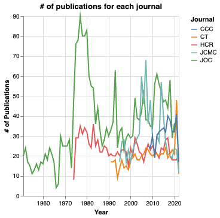
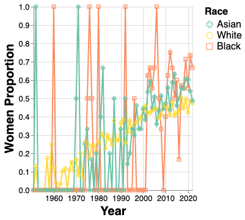
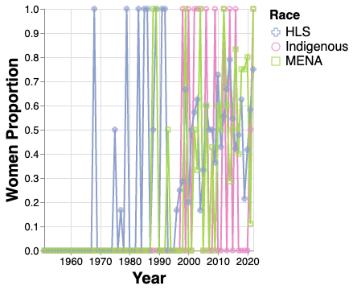

```{r setup, include=FALSE}
library(car)
library(olsrr)
library(stargazer)
library(bookdown)
```


# Interactive visualizations

Interactive visualizations showing the distribution of race and gender in different countries/regions are available at [https://icavis.netlify.app/](https://icavis.netlify.app/).

# Intercoder reliability 

In the Methods section of the manuscript, we mentioned that 

>Once coders had completed training, we randomly selected 100 authors among all 11,304 authors for inter-coder reliability and achieved a Krippendorff alpha of 0.91 for race and 0.94 for gender.

Note that when we calculated the gender intercoder reliability here, the sample included 160 subsequently deleted authors whose affiliation data was missing.

# Number of publications for each journal

See Figure S\@ref(fig:numofpub).

```{r numofpub, echo=FALSE, fig.cap="Number of publications for each journal by year", out.width = '50%'}

```

# Women proportion among authors of different racial groups

See Figure S\@ref(fig:wp1) and Figure S\@ref(fig:wp2).


```{r wp1, echo=FALSE, fig.cap="Women proportion", out.width = '50%', fig.pos = 'H'}

```

```{r wp2, echo=FALSE, fig.cap="Women proportion", out.width = '50%', fig.pos = 'H'}

```

# Collaboration analysis

Please note that in our discussion of collaboration patterns, "white-only", "men-only", and "women-only" papers included those by solo authors. 

# Citation Analysis
## Read data

The first step is to read data:

```{r read data}
df <- read.csv("data/papers_to_study_expanded.csv")
df$Year.Distance.from.2022 = abs(df$year - 2022)

# do the log10 transformation on citation counts
df$gscholar_citation_log10 <- log10(df$gscholar_citation + 0.1)
var_cols <- c(1, 16:17, 20:33, 35:36)
data <- df[, var_cols]
```

## Deal with univariate outliers

```{r}
hist(data$gscholar_citation_log10)
data$gscholar_citation_log10_stdized <- scale(
  data$gscholar_citation_log10,
  center = T,
  scale = T
)
data$outlier0 <- ifelse(data$gscholar_citation_log10_stdized > 3.3 | 
                          data$gscholar_citation_log10_stdized < -3.3,
                        1, 0
)
table(data$outlier0)
```

As can be seen, there are 103 outliers. 

## Build model

```{r}
# '10.1111/j.1460-2466.1977.tb02133.x', '10.1111/j.1460-2466.1952.tb00171.x' 
# These two papers have no gscholar data, and they will be excluded in the following line because its outerlier0 is N/A, not 0. 
datanew <- subset(data, outlier0 == 0)
datanew$outlier0 <- NULL
datanew$gscholar_citation_log10_stdized <- NULL

model <- lm(gscholar_citation_log10~., datanew)
```

## Dianostics

```{r}
## Normality
ols_plot_resid_qq(model)

#Correlation between observed residuals and expected residuals under normality.
ols_test_correlation(model)

ols_plot_resid_hist(model)

## linearity & homoscedasticity 
ols_plot_resid_fit(model)

## collinearity diagnostics
# ols_coll_diag(model)
vif(model)
```

## Run Model

```{r}
summary(model)
```
